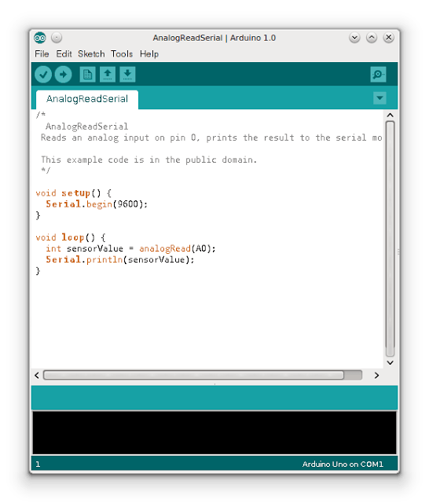
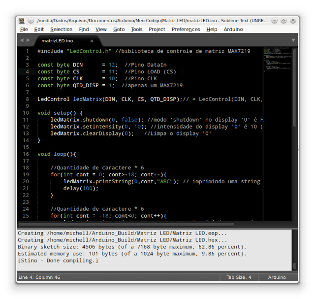

Title: Ambiente de desenvolvimento: Arduino + Sublime Text
Date: 2014-06-03T17:18:00-07:00
Category: Tutorial
Tags: Arduino, Tutorial, C++, Sublime Text, Software
Author: Michell Stuttgart
Summary: Algoritmo que imprime todos os divisores de um dado número inteiro fornecido pelo usuário.

Há algum tempo, tipo o prazer de participar de um minicurso abordando o básico sobre o desenvolvimento usando a plataforma Arduino. Após a instalação das bibliotecas necessárias, também foi necessário instalar a Arduino IDE, um ambiente de desenvolvimento próprio para programação nessa plataforma.

Apesar da IDE oferecer suporte a todos os recursos do Arduino, o seu editor de texto era simples demais, sem funções que são comuns a muitos editores, como auto-completar, fechamento automático de *{}* e entre outras coisas básicas. Uma vez que eu estou acostumado a editores de texto mais avançados, acabei me sentindo bastante desconfortável e parti em busca de outra alternativa. Foi então que descobri a combinação `SublimeText + Stino`.

O Sublime Text um editor de texto e IDE bem conhecido por programadores. Possui muitos recursos bacanas como auto-completar, suporte a múltiplas linguagens de programação e uma infinidade de plugins, temas e possui versões para diversos sistemas operacionais. O Sublime Text pode ser baixado aqui. Para Linux, temos um pacote com a extensão .deb. Para instalá-lo basta dar dois cliques no arquivo, inserir a senha de administrador e seguir com a instalação normalmente.

Com o Sublime Text instalado, vamos dar prosseguimento a instalação do plugin Stino, para suporte ao Arduino.

Inicialmente, vamos instalar o plugin que permite a instalação de packages no Sublime Text. Caso já o tenho instalado, pode ignorar estas etapas.

Execute o Sublime Text e vá em:  `View -> Show Console`.

Na área inferior da janela do Sublime Text, irá aparecer um campo de texto onde você deve colar o código encontrado aqui, de acordo com a versão do Sublime Text. Após copiar e colar o texto no campo de texto do Sublime Text, tecle Enter. Após a instalação, reinicie o Sublime Text.

Depois de reiniciar o Sublime Text, clique no menu: `Preferences -> Package Control`.
No campo de texto Package Control, digite: `Install Package`.

Aguarde alguns segundo e irá aparecer outro campo de texto para você entrar com o nome do package.
Digite Arduino e irá aparecer um package chamado `Arduino Like IDE`. Selecione-o e aguarde alguns segundos para a instalação completar (você pode verificar o progresso da instalação na área inferior da janela do Sublime Text). Após completada a instalação, reinicie o Sublime Text.

Depois de reiniciar o Sublime Text, vá em Preferences e selecione a opção `Show Arduino Menu` (se já não estiver selecionado). Fazendo isso, um novo menu chamado "Arduino" surgirá ao lado do menu Help.

Para o próximo passo, clique em: `Arduino -> Preferences -> Select Arduino Application Folder`.

Insira a localização da instalação das bibliotecas do Arduino no seu sistema. A minha está em `/usr/share/arduino`.

Uma que você tenha escolhido o diretório correto, uma mensagem do tipo

> Arduino x.x.x is found at /usr/share/arduino

irá aparecer.

Agora você pode desenvolver seus programas usando o Sublime Text e utilizar as opções do menu Arduino, como compilar, fazer upload do seu código, selecionar o modelo do Arduino, a porta usada para comunicação e todos os outros recursos que a Arduino IDE possuía e muito mais. Você verá também que a velocidade de compilação e upload usando o Sublime Text é muito maior do que a realizada pela Arduino IDE.

É isso pessoal. Agora você já pode se divertir com Arduino desenvolvendo seus códigos em um editor de texto profissional.

Esse tutorial foi baseado nas informações contidas [aqui](https://github.com/Robot-Will/Stino).

Obrigado por ler e até o próximo post!
