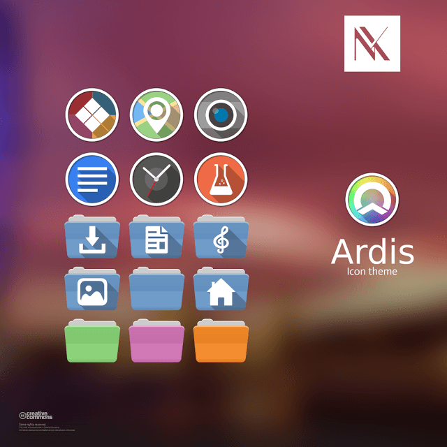

Title: Linux - Ícones para Ubuntu, Linux Mint e derivados
Slug: icones-para-ubuntu-linux-mint-e-derivados
Date: 2014-06-20T09:34:00-07:00
Category: Temas
Tags: linux, ubuntu, linux mint, icones, ardis, numix
Author: Michell Stuttgart
Summary: Conjunto de temas de ícones para Ubuntu, Linux Mint e derivados.

### Numix Icon Theme Circle

Versão do tema de ícone [Numix](https://numixproject.org/) com ícones arredondados.


Inicialmente, adicionamos o repositório do tema. Abra o terminal e digite:

```bash
sudo add-apt-repository ppa:numix/ppa
sudo apt-get update
sudo apt-get install numix-icon-theme-circle
```

Para conhecer a página do projeto, clique [aqui](https://numixproject.org/).

### Ardis Icon Theme

Um dos meus temas de ícones preferidos.



```bash
sudo add-apt-repository ppa:noobslab/icons
sudo apt-get update
sudo apt-get install ardis-icons
```

Para conhecer a página do projeto, clique [aqui](https://github.com/skwerlman/Ardis-icon-theme).

### Humanity Colors Icon Theme

Temas de ícones Humanity em diversas cores.


```bash
sudo add-apt-repository ppa:ravefinity-project/ppa
sudo apt-get update
sudo apt-get install humanity-colors
```

Para conhecer a página do projeto, clique [aqui](http://www.ravefinity.com/p/humanity-colors-icon-theme.html).

É isso pessoal. Até a próxima.
