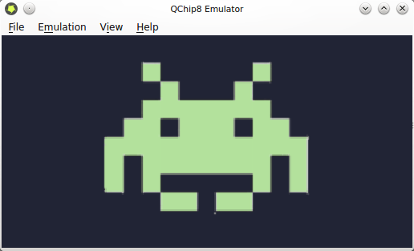
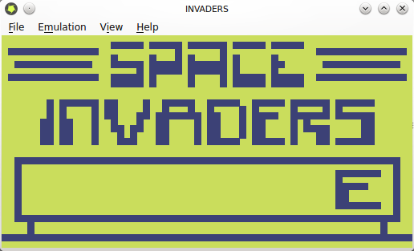
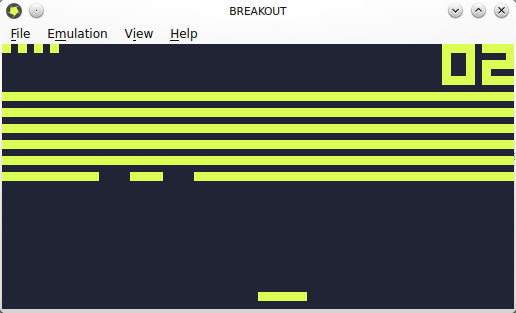

Title: QChip8 Emulator: meu primeiro emulador
Date: 2014-06-24T20:11:00-07:00
Category: Projetos
Tags: emulador, projeto, software
Author: Michell Stuttgart
Summary: Detalhes do meu projeto de criação de emulador para a máquina virtual CHIP8.

Se há algo na área de games que sempre me chamou a atenção, sem dúvida, são os emuladores. Sempre achei fantástico a ideia de poder rodar jogos e aplicativos de um sistema em outro sistema totalmente diferente. Então, semanas atrás resolvi estudar um pouco sobre esse tipo de aplicação. Após algumas pesquisas, vi que criar um emulador para o CHIP8 é um ótimo passo para quem não possui experiência em desenvolvimento de emuladores, devido a sua simplicidade.

[CHIP8](http://en.wikipedia.org/wiki/CHIP-8) é uma linguagem de programação interpretada usada na década de 70 nos computadores COSMAP VIP e TELMAC 1800. Os programas em CHIP8 são executados sobre uma máquina virtual própria. Assim, o emulador que implementei é na verdade um emulador dessa máquina virtual, e não dos computadores onde ela rodava. A linguagem foi muito usada por entusiastas em desenvolvimento de games.

O [QChip8 Emulator](https://github.com/mstuttgart/qchip8-emulator) foi implementado usando C++ para as rotinas de emulação e Qt para a interface. O emulador ainda não tem som, o que não atrapalha em nada a diversão já que o som do CHIP8 original era um simples tom.  Todos os jogos do CHIP8 são em preto-e-branco, então implementei vários temas de cores para quem não gostar do tema clássico. As Roms dos jogos do CHIP8 são gratuitas e podem ser encontrados fazendo uma simples busca no Google por `"CHIP8 roms"`.

Futuramente pretendo escrever uma série de tutoriais demonstrando os passos para criar um emulador do CHIP8 (e quem sabe, de outros emuladores também).

Se você já tem experiência em programação é não quer esperar meus tutoriais, segue os links que usei para estudar:

* [How to write an emulator chip 8 interpreter](http://www.multigesture.net/articles/how-to-write-an-emulator-chip-8-interpreter/)
* [Introduction to chip 8](http://www.emulator101.com.s3-website-us-east-1.amazonaws.com/introduction-to-chip-8/)
* [Cowgod's Chip 8](http://devernay.free.fr/hacks/chip8/C8TECH10.HTM)

Aqui você pode conferir mais informações do [QChip8 Emulator](https://github.com/mstuttgart/qchip8-emulator).

Segue o link do emulador para quem desejar estudá-lo e/ou usá-lo: clique [aqui](https://github.com/mstuttgart/qchip8-emulator).
Futuramente pretendo também disponibilizar uma pacote `.deb` e `.rmp` para distribuições Linux.

É isso pessoal. Até a próxima!
