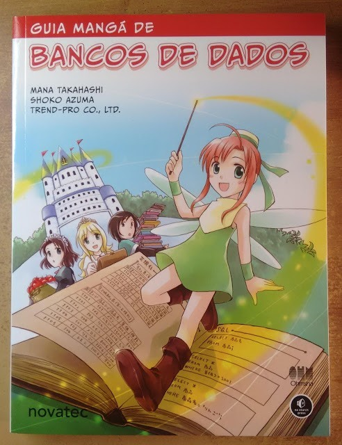
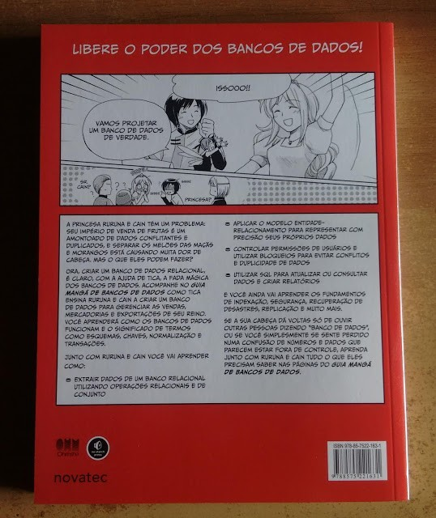

Title: Dica de leitura - Guia Mangá de Banco de Dados
Slug: dica-de-leitura-guia-manga-de-banco-de-dados
Date: 2016-03-20 14:41:29 -0300
Category: Livro
Tags: livro, banco de dados
Author: Michell Stuttgart
Summary: Minha opinião sobre o livro "Guia Mangá de Banco de Dados" da editora Novatec.

Quando pensamos em mangás, imediatamente nomes como Naruto, One Piece e Cavaleiros do Zodíaco vem a nossa mente. Eu, como todo fã de quadrinhos, sempre procuro ler obras novas ou que me despertem a curiosidade. Grande surpresa foi a minha quando descobri que a editora Novatec, conhecida por seus livros técnicos, havia publicado um mangá. Foi aí que juntei a curiosidade (e um pouco de dinheiro) e resolvi adquirir um exemplar.

O mangá em questão é o livro `Guia Mangá de Banco de Dados`.

Com 224 páginas, o livro de autoria de Mana Takashi e Shoko Azuma, é a versão brasileira da obra da editora `Ohmsha` do Japão, e faz uso de uma narrativa típica de um mangá, com momentos muito cômicos sem abrir mão de uma história coerente (seguindo o conceito do mangá) e explicando muito bem a utilidade e o projeto de um banco de dados.

No mangá, acompanhamos a jornada da princesa Ruruna e de seu amigo Cain em busca de uma solução para o problema de registro das informações de venda, produção de mercadorias e exportação do seu reino. Os pais de Ruruna querem apenas saber de se divertir e deixam nas mão da princesa a tarefa de organizar a bagunça. Nesse ponto, através da orientação da fada Tica, uma `Fada Mágica dos Bancos de Dados` (apele para ela durante a prova de DB), Ruruna e Cain irão encontrar uma solução para o armazenamento e gerenciamento de informações sobre a produção do reino.

O livro consegue de maneira muito interessante demonstrar todos os passos da implantação de um sistema, desde da análise do problemas do atual sistema de armazenamento de informações usado pelo reino, o estudo do porquê um banco de dados ser uma solução certeira até o plajenamento de como será o sistema, como definição das tabelas, atributos e etc. O livro aborda pontos como o problema com informações duplicadas e genreciamento de sistem descentralizado, onde não existe controle sobre a validade das informações inseridas no sistema.

Todos os conceitos envolvendo banco de dados são abordados de uma maneira simples, porém prática. Conceitos como tabelas, Entidade-Relacionamento, consultas e atualização de dados são visitados pela fada Tica. Entre um conceito e outro, a história das personagens vão se desenvolvendo, contextualizando muito bem as lições ensinadas. Outro ponto positivo do livro são os desenhos, que apesar de simples, possuem traços suaves e agradáveis de ver.

Eu cursei a disciplina de Banco de Dados durante minha graduação e consegui relembrar muito pontos importantes sobre Banco de Dados e até mesmo aprender coisas novas, graças ao ponto de vista utilizado pelo livro (bem diferente do usado em uma sala de aula). Então, se você é um estudante de TI, um entusiasta da tecnologia, curte ler quadrinhos ou mesmo ficou curioso, eu recomendo o livro.

Caso se interesse, o site da Novatec possui um link com amostra do livro  [aqui](http://novatec.com.br/download/amostras/amostra-manga-banco-de-dados.pdf) e o mesmo pode ser adquirido [aqui](http://novatec.com.br/livros/mangabd/).

Este livro abriu minha curiosidade para comprar o guia mangá de outras temas e pretendo fazer análise de cada um deles assim que terminar de lê-los.

É isso. Obrigado por ler e até a próximo *post*.
